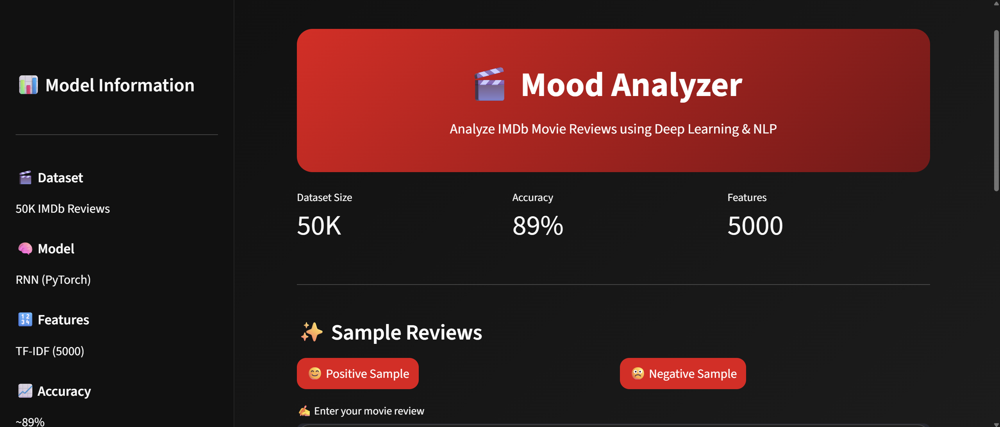

# 🎬 Mood Analyzer

AI-powered IMDb Movie Review Sentiment Analysis using PyTorch RNN and TF-IDF.

## Features

- Sentiment Classification (Positive / Negative)
- RNN-based Deep Learning Model
- TF-IDF Feature Extraction
- Interactive Streamlit Dashboard
- Prediction Confidence Score
- Prediction History

## Tech Stack

- Python
- PyTorch
- Streamlit
- Scikit-Learn
- NLTK
- Pandas

## Dataset

IMDb 50K Movie Reviews Dataset

## Model Performance

- Accuracy: ~89%
- Features: 5000 TF-IDF Features
- Architecture: RNN

## Screenshot



## Run Locally

```bash
pip install -r requirements.txt
streamlit run app.py
```

## Author

Vedant Deshmukh
